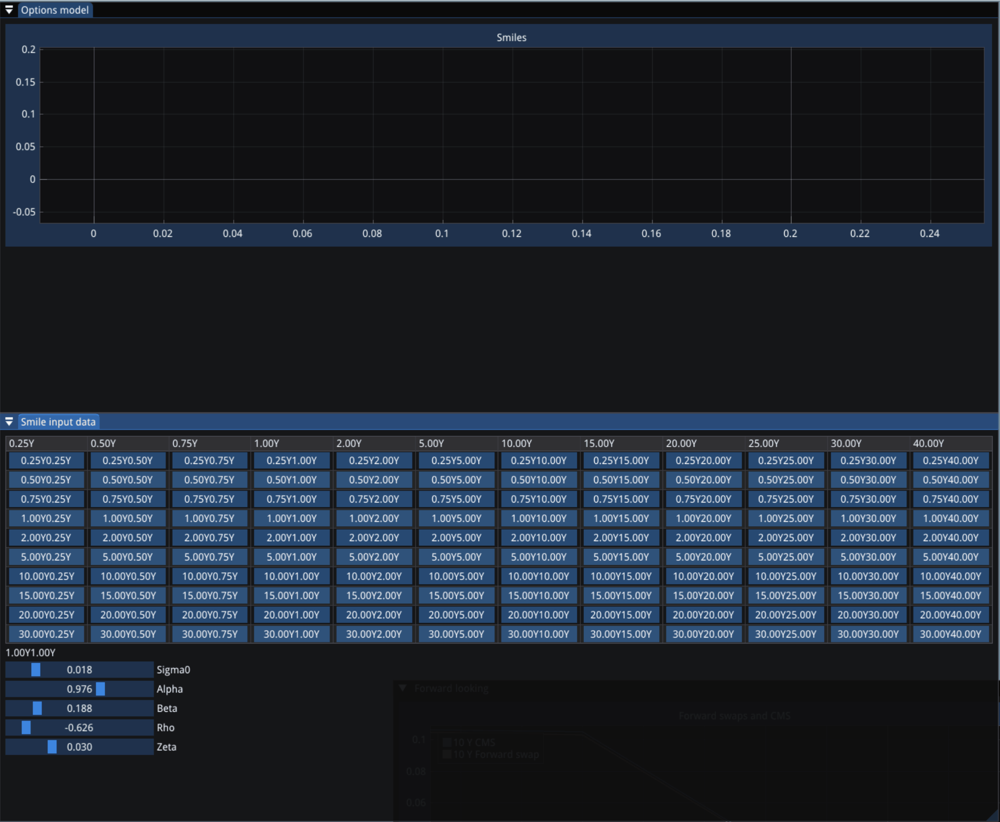

# F.A.S.T.E.R.
**Fast Analytics and Stripping Tool for Exotic Rates**

F.A.S.T.E.R. is a high-performance C++ application for constructing yield curves, calibrating interest rate models, and analyzing vanilla and exotic interest rate derivatives — all in real time.

Built for speed and precision, F.A.S.T.E.R. provides a GUI that lets users intuitively manipulate forwards, swaps, and options to generate and visualize term structures. The tool supports light exotic pricing, volatility smiles, and calibration of a one-factor short rate model.

---

## ✨ Features

- 🔁 **Curve Construction** via forward rates, swaps, and option instruments
- 🧮 **Real-Time Model Calibration** (e.g., short rate models)
- 📉 **Support for Vanilla + Light Exotic Options**
- 📊 **Visual Output** of term structures, implied volatility surfaces, and model fits
- 🔧 **Python Extension Compatible** (`.pyd`) version for scriptable access
- ⚡ **High-Performance C++ Core** with real-time feedback loop from UI adjustments

---

## 🖥️ Interface

The GUI includes:
- Sliders for instrument inputs (e.g., forward rates, swap points, option strikes)
- Live-updating charts for:
  - Discount factor and forward curves
  - Volatility smiles
  - Calibration diagnostics

The goal is to make sophisticated models interactively explorable.

---

## 📦 Build Instructions

### Dependencies
- C++20-compatible compiler (e.g., MSVC, clang, GCC)
- Python 3.12+ (for optional `.pyd` build)
- [ImGui](https://github.com/ocornut/imgui) + your preferred backend (e.g., GLFW + OpenGL)
- CMake (recommended)

### Building the GUI application:
Everything should compile from a single translation unit on Windows and Linux, MacOS/iOS versions use the XCode build system.
**Linux**
\`\`\`sh
git clone https://github.com/palinor/faster.git
cd faster
clang++ linux_main.cpp -o faster -O3 -std=c++20 --include-directory ${workspaceFolder}/imgui/ --include-directory ${workspaceFolder}/imgui/backends

See .vscode/tasks.json for pre-existing build configurations.

**Windows**
git clone https://github.com/palinor/faster.git
From here you can either open analytics.sln in Visual Studio, or run the following in x64 Native Tools Command Prompt:
cl /std:c++20 /Zi /I imgui/backends /O2 /I imgui winmain.cpp /link /OUT:faster.exe

**MacOS/iOS**
git clone https://github.com/palinor/faster.git
Open Apple/demo_gui.xcodeproj in XCode, and build either the Mac or iOS versions of the app.
\`\`\`

### Building the Python extension:
(Example using MSVC command line)
\`\`\`sh
cl /std:c++20 /LD /I"path\to\python\include" fastermodule.cpp path\to\python\libs\python312.lib /Fe:faster.pyd
\`\`\`

More detailed build scripts for Linux/Mac/Windows coming soon.

---

## 🧪 Example Use Cases

- Visualize how different forward curves move
- Calibrate a short-rate model to market instruments
- Explore volatility smiles and their impact on pricing

---

## 🚧 Roadmap

- [ ] Scriptable strategy editor (Python interface or internal DSL)
- [ ] Save/load calibration sessions
- [ ] More calibration models (e.g. multi-factor short rate models)
- [ ] Automated testing framework
- [ ] Blog post / docs site

---

## 📖 License

See `LICENSE` file.

---

## 🔬 Disclaimer

F.A.S.T.E.R. is a personal research project and is not intended for production trading or financial advice. Use at your own risk.
